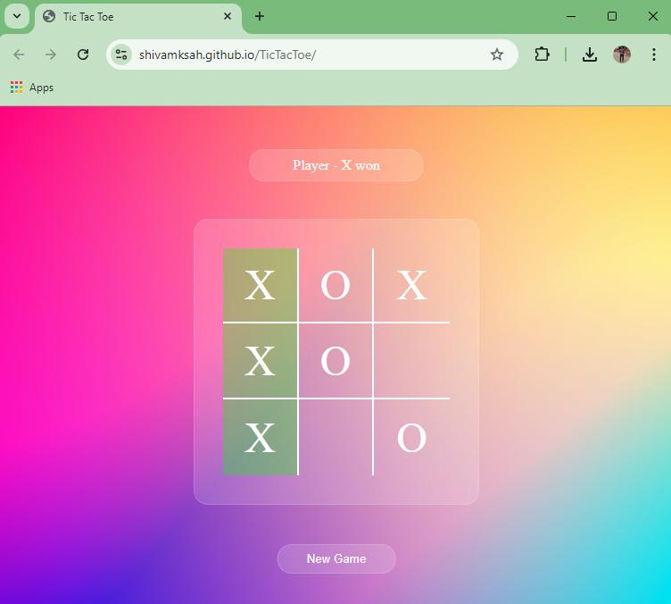

# 🎮 Tic Tac Toe Game

Welcome to the **Tic Tac Toe Game**! This is a simple, fun game built using **HTML**, **CSS**, and **JavaScript** where two players can compete against each other.

## 🌐 Play the Game Live

**[Click here to play the game!](https://shivamksah.github.io/TicTacToe/)**

## 🛠️ Features

- **Two-Player Mode**: Play against a friend, taking turns as "X" and "O".
- **Responsive UI**: Designed to look good on various screen sizes.
- **Dynamic Gameplay**: Real-time game updates with win detection and highlights.

## 🚀 Getting Started

Follow the steps below to run the game locally:

1. **Clone the repository**:
    ```bash
    git clone https://github.com/your-username/tic-tac-toe.git
    ```
2. **Open the `index.html` file** in your favorite browser.

## 🕹️ How to Play

- Player 1 starts as "X" and Player 2 as "O".
- Click on an empty box to place your mark.
- The first player to align three marks horizontally, vertically, or diagonally wins the game! 🏆
- If all boxes are filled without a winning combination, it’s a draw! 🤝

## 📸 Screenshots



## 🤖 Tech Stack

- **HTML**: Structure of the game
- **CSS**: Styling for a visually appealing interface
- **JavaScript**: Logic for game mechanics and interactivity

## 🎯 Future Enhancements

- Add a single-player mode with AI.
- Implement sound effects and animations.

## 🤝 Contributing

Feel free to fork this repository, make your changes, and submit a pull request. Contributions are welcome! 

## 📄 License

This project is open-source and available under the [MIT License](LICENSE).
